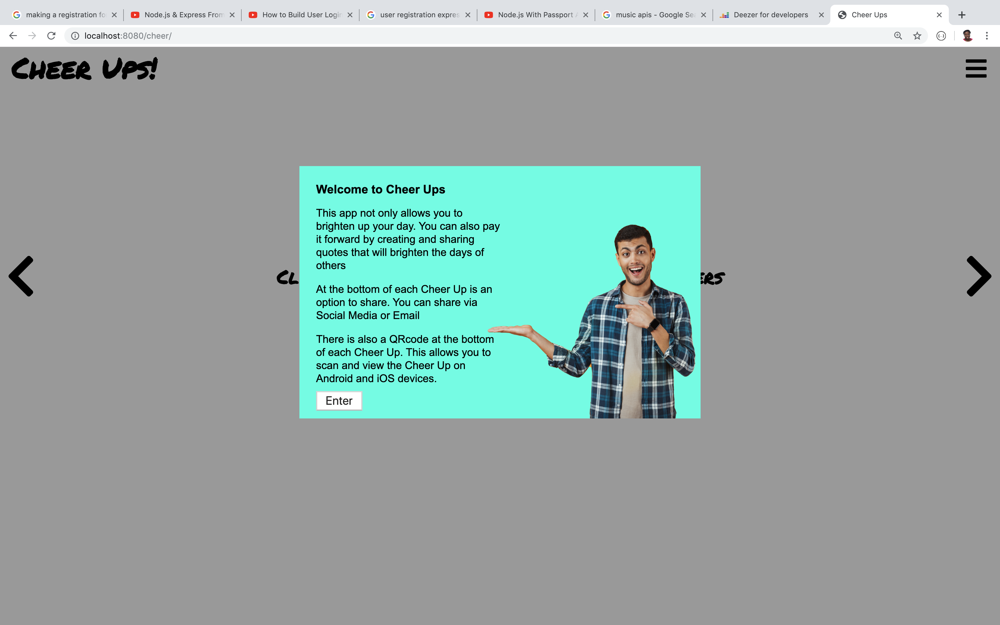
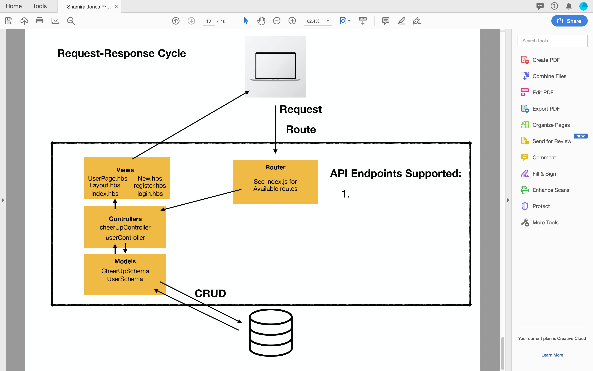
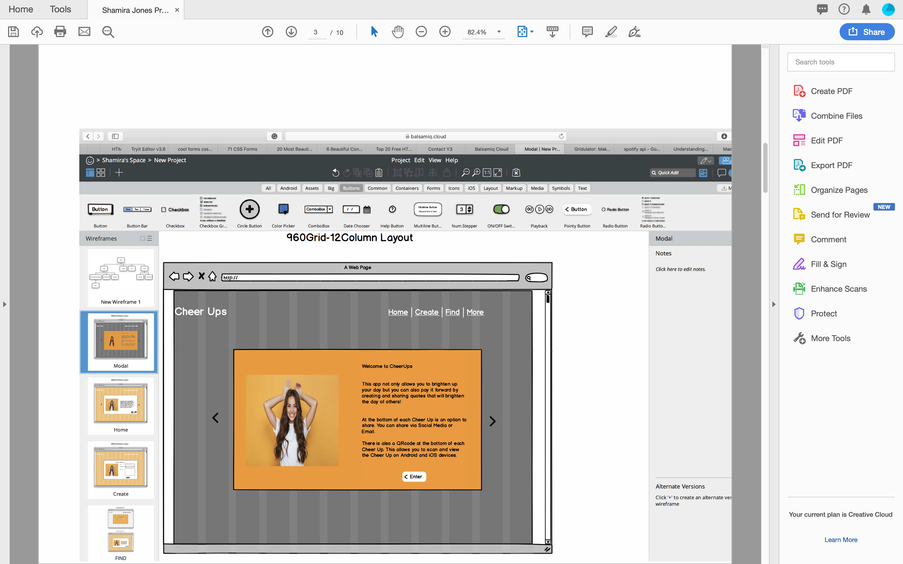

# Cheer-Ups

## This is a site that encourages everyone and hopes to cheer up those that visit the page.

http://cheerups2019.herokuapp.com

---
##Motivation

The motivation of this app was based on the fact that I believe that when individuals take just a moment to say something nice to one another, it can cause a Positive Dominio Effect.

---
##Getting Started

To start this project I brainstormed started with just drawing the Request Response Cycle and how it related to my project. I created a User Story so that I can think as a user what features and functionality would be desirable.

I connected to Heroku and Github as early as possible.

The frameworks that I used for this project includes  HTML, JavaScript, CSS, Express, MongoDB, Heroku, and Mongoose.

I started off building my index.js, my models, controllers, views, and seeding my database. The index.js is my router. The Models are so I know how information is suppose to be presented. The controllers are for my routes and ensuring my app knows how to get to various views or pages. 

As usual I commited often to Heroku and Github.
I used Postman to check for errors along with. I used nodemon to connect and see my updates. 

I'm excited to see my user's input.